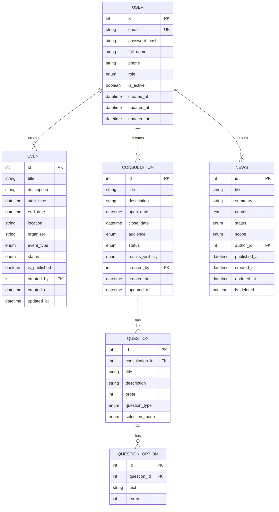

# Data Model

## Overview
The database is a relational PostgreSQL database.

## Entities

### User (`users`)
Represents a registered user of the system.

| Field | Type | Constraints | Description |
|-------|------|-------------|-------------|
| `id` | Integer | PK, Auto-inc | Unique identifier |
| `email` | String | Unique, Not Null | User's email address (login) |
| `password_hash` | String | Not Null | Hashed password |
| `full_name` | String | Not Null | User's full name |
| `phone` | String | Nullable | Contact phone number |
| `role` | Enum | Not Null, Default='SUPPORTER' | `ADMIN`, `BOARD_MEMBER`, `MEMBER`, `SUPPORTER` |
| `is_active` | Boolean | Default=True | Soft delete / deactivation flag |
| `created_at` | DateTime | Default=Now | Timestamp of creation |
| `updated_at` | DateTime | OnUpdate=Now | Timestamp of last update |

### Event (`events`)
Represents an event in the calendar.

| Field | Type | Constraints | Description |
|-------|------|-------------|-------------|
| `id` | Integer | PK, Auto-inc | Unique identifier |
| `title` | String | Not Null | Event title |
| `description` | String | Nullable | Detailed description |
| `start_time` | DateTime | Not Null | Start date and time |
| `end_time` | DateTime | Not Null | End date and time |
| `location` | String | Not Null | Physical or virtual location |
| `organizer` | String | Not Null | Organizer name |
| `event_type` | Enum | Not Null | `PUBLIC`, `MEMBERS_ONLY`, `BOARD_ONLY` |
| `status` | Enum | Not Null, Default='DRAFT' | `DRAFT`, `PUBLISHED`, `CANCELLED`, `COMPLETED` |
| `is_published` | Boolean | Default=False | Publication flag |
| `created_by` | Integer | FK(User) | Creator of the event |
| `created_at` | DateTime | Default=Now | Creation timestamp |
| `updated_at` | DateTime | OnUpdate=Now | Last update timestamp |

### Consultation (`consultations`)
Represents a neighborhood consultation (questionnaire).

| Field | Type | Constraints | Description |
|-------|------|-------------|-------------|
| `id` | Integer | PK, Auto-inc | Unique identifier |
| `title` | String | Not Null | Consultation title |
| `description` | Text | Nullable | Context/Instructions |
| `open_date` | DateTime | Nullable | Scheduled opening time |
| `close_date` | DateTime | Nullable | Scheduled closing time |
| `audience` | Enum | Not Null | `MEMBERS_ONLY`, `MEMBERS_AND_SUPPORTERS` |
| `status` | Enum | Not Null, Default='DRAFT' | `DRAFT`, `OPEN`, `CLOSED`, `ARCHIVED` |
| `results_visibility` | Enum | Not Null, Default='PRIVATE' | `PRIVATE`, `PUBLIC` |
| `created_by` | Integer | FK(User) | Creator (Admin) |
| `created_at` | DateTime | Default=Now | Creation timestamp |
| `updated_at` | DateTime | OnUpdate=Now | Last update timestamp |

### Question (`questions`)
A question within a consultation.

| Field | Type | Constraints | Description |
|-------|------|-------------|-------------|
| `id` | Integer | PK, Auto-inc | Unique identifier |
| `consultation_id` | Integer | FK(Consultation) | Parent consultation |
| `title` | String | Not Null | Question text |
| `description` | Text | Nullable | Extra info |
| `order` | Integer | Not Null, Default=0 | Sort order |
| `question_type` | Enum | Not Null | `CLOSED`, `OPEN` |
| `selection_mode` | Enum | Nullable | `SINGLE`, `MULTIPLE` (for Closed Qs) |

### QuestionOption (`question_options`)
An option for a closed question.

| Field | Type | Constraints | Description |
|-------|------|-------------|-------------|
| `id` | Integer | PK, Auto-inc | Unique identifier |
| `question_id` | Integer | FK(Question) | Parent question |
| `text` | String | Not Null | Option label |
| `order` | Integer | Not Null, Default=0 | Sort order |

### News (`news`)
Represents a news article or announcement.

| Field | Type | Constraints | Description |
|-------|------|-------------|-------------|
| `id` | Integer | PK, Auto-inc | Unique identifier |
| `title` | String | Not Null | Article title |
| `summary` | String | Nullable | Short summary / teaser |
| `content` | Text | Not Null | Full HTML content |
| `cover_url` | String | Nullable | URL to cover image |
| `status` | Enum | Not Null, Default='DRAFT' | `DRAFT`, `PUBLISHED`, `ARCHIVED` |
| `scope` | Enum | Not Null, Default='GENERAL_BARRIO' | `GENERAL_BARRIO`, `INTERNO_ASOCIACION` |
| `author_id` | Integer | FK(User) | Creator of the news |
| `published_at` | DateTime | Nullable | When it was published |
| `created_at` | DateTime | Default=Now | Creation timestamp |
| `updated_at` | DateTime | OnUpdate=Now | Last update timestamp |
| `is_deleted` | Boolean | Default=False | Soft delete flag |

## Diagram

