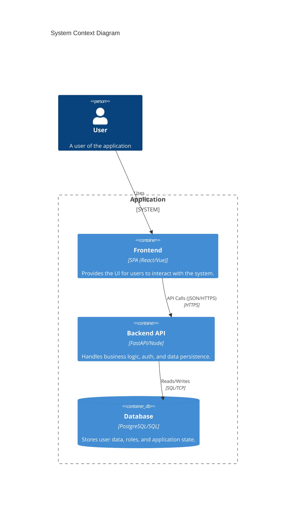
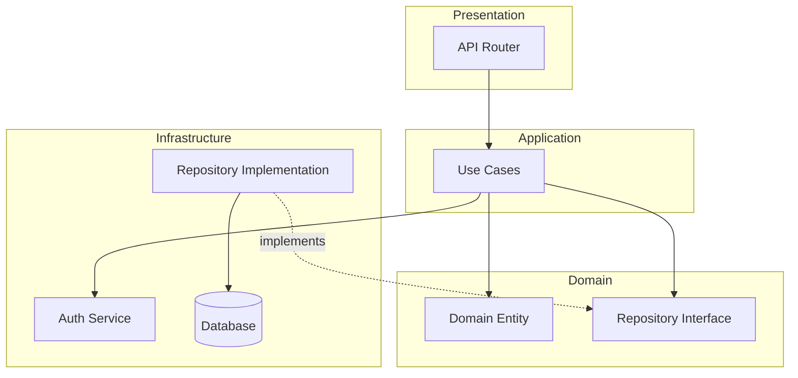

# Architecture

## High-Level Overview
The system follows a **Clean Architecture** (also known as Hexagonal Architecture) approach to ensure separation of concerns, testability, and maintainability.

### Layers

1.  **Domain Layer**: Contains the core business logic and entities. It defines interfaces (Ports) for repositories but has no external dependencies.
2.  **Application Layer**: Contains Use Cases. It orchestrates the domain logic and interacts with the infrastructure via interfaces.
3.  **Infrastructure Layer**: Implements the interfaces defined in the domain (Adapters). Includes Database access, Auth services, and external integrations.
4.  **Presentation Layer**: Handles the HTTP interface (e.g., FastAPI Routers) and Data Transfer Objects (DTOs). It maps HTTP requests to Use Case calls.

## Authentication & Authorization
- **Authentication**: Stateless, typically using **JWT (JSON Web Tokens)**.
    - User logs in -> Server validates credentials -> Returns JWT.
    - Client sends JWT in `Authorization: Bearer <token>` header.
- **Authorization**: Role-Based Access Control (RBAC).
    - Middleware/Dependency checks the user's role from the JWT payload or DB lookup against the required role for the endpoint.

## Component Diagram (Generic)

## Module Interaction (Generic Pattern)

